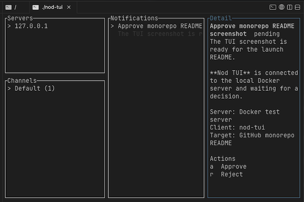

# Nod TUI


<p align="center">
  
</p>


`nod-tui` is the first-class terminal client for Nod. It links directly to
`nod-client-core`, so enrollment, keyring storage, decision signing, local state,
and WebSocket sync match the desktop client.

## Run

From `client/`:

```bash
cargo run --manifest-path ./nod-tui/Cargo.toml
```

The first run opens the enrollment screen. Enter the Nod server URL, device
name, and enrollment code, then press Enter. Existing desktop/core enrollments
are reused because the TUI uses the same core config and keyring entries. For
ephemeral demos or machines without a working OS keyring, set
`NOD_CLIENT_CORE_INSECURE_TOKEN_STORE=1` before launch to keep credentials in
the local core config file instead.

## Keys

- `j`/`k` or arrows: move through the focused pane.
- `Tab`: cycle focus between servers, channels, requests, and detail.
- `Enter`: open the selected request detail or submit the active form.
- `a`: approve the selected request when an approve option exists.
- `r`: reject the selected request when a reject option exists.
- `d`: dismiss the selected request.
- `n`: open the text response editor for note-required options.
- `c`: clear the selected channel.
- `R`: refresh from the server.
- `/`: filter visible requests.
- `s`: focus the server list.
- `,`: open settings.
- `m`: mute or unmute terminal alerts.
- `?`: show help.
- `q` or Esc: close a modal; `q` quits from the main screen.
- `Ctrl-C` or `Ctrl-D`: quit from any screen.

## Settings

Settings include channel subscriptions, notification sound preference, device
listing, device rename, device revoke, forget server, and the TUI-local alert
mute toggle. The alert mute is intentionally local to the terminal session and
does not change the server notification preference.

## Terminal Alerts

New `notification_candidate` runtime events ring the terminal bell, briefly
highlight the status bar, and update pending counts. The initial server snapshot
does not ring. When the server removes or resolves a request, the active
alert marker clears.

In tmux, bell behavior follows tmux and terminal settings such as `bell-action`,
`visual-bell`, and the outer terminal's audible bell configuration.

## Limitations

- The TUI does not send OS desktop notifications.
- Links are displayed as text; opening links is left to the terminal user.
- This is an interactive TUI, not a scriptable one-shot CLI. A separate command
  mode can be layered on later without changing the core runtime.
